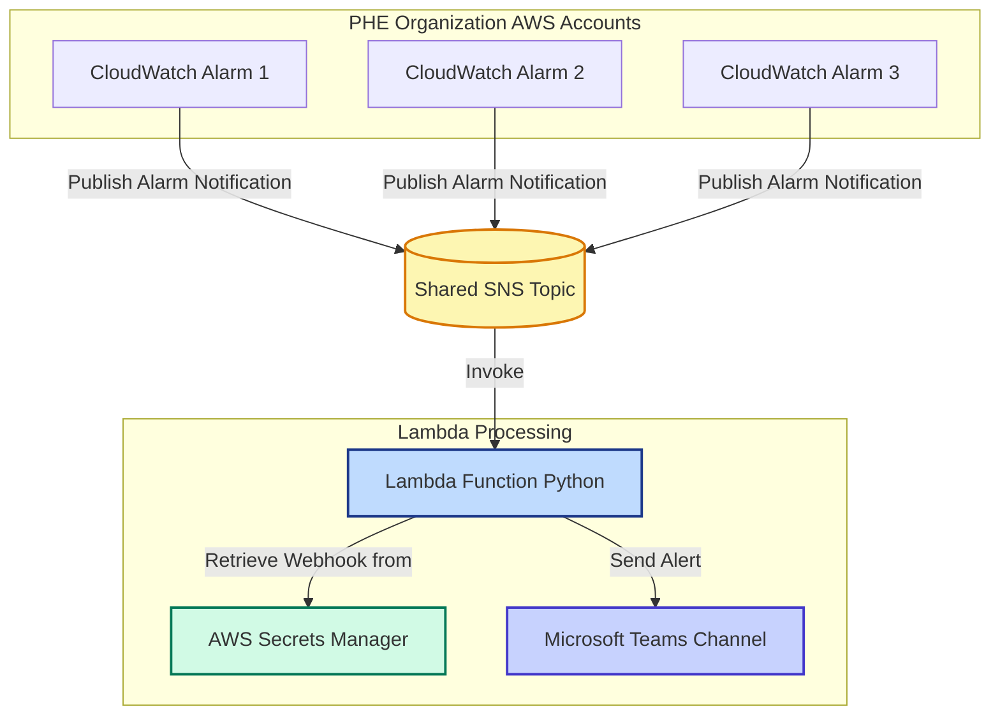

## PHE Alarms
A Python Lambda function that subscribes to the SNS topic. When an alarm notification is received on the SNS topic, the Lambda forwards the alert to Teams.

Infrastructure as Code is stored in [devops-phe-alarms-iac](https://github.com/ukhsa-collaboration/devops-phe-alarms-iac).

## Architecture Diagram

