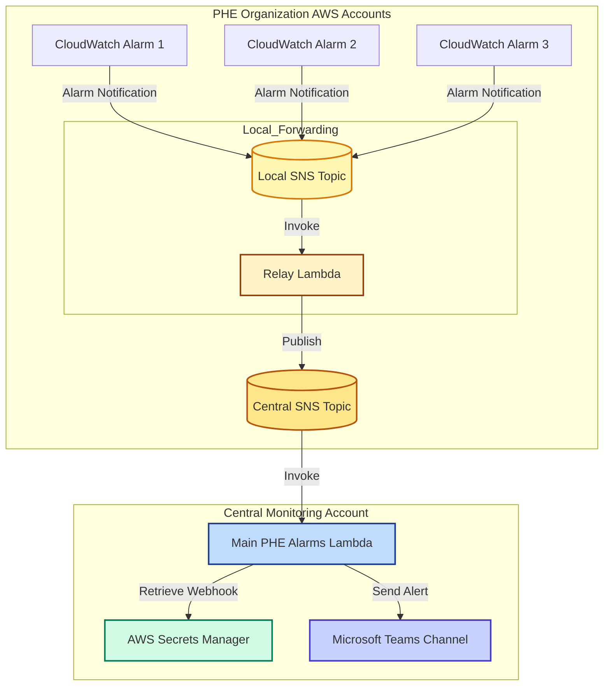

## PHE Alarms
A Python Lambda function that subscribes an SNS topic. When an alarm notification is received on the SNS topic, the Lambda forwards the alert to Teams.

# Overview
When CloudWatch alarms trigger in any participating AWS account, they can publish alarm notifications to a local SNS topic. A lightweight relay Lambda that is subscribed to that local topic then forwards the notification to a central SNS topic in the monitoring account. This Lambda receives notifications from that centralised SNS topic and sends formatted alerts to Teams via a webhook URL stored in AWS Secrets Manager. This avoids needing to deploy complex code to multiple accounts and having to manage the Teams webhook in multiple places.

This setup works around the limitation that CloudWatch alarms cannot include PrincipalOrgID in their SNS permissions — avoiding the need to maintain a list of individual AWS account IDs allowed to publish directly.

Infrastructure as Code is stored in [devops-phe-alarms-iac](https://github.com/ukhsa-collaboration/devops-phe-alarms-iac).
StackSet deploying the relay Lambdas is stored in [ohid-aws-landing-zone](https://github.com/ukhsa-collaboration/ohid-aws-landing-zone).

## Architecture Diagram

